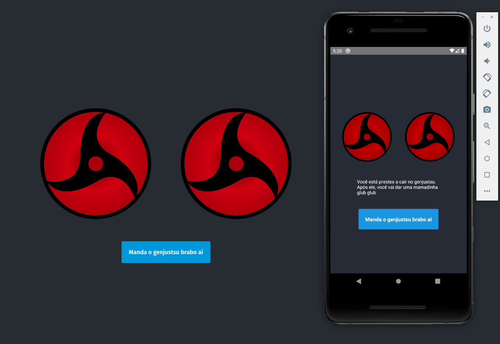

# React Native web Sharingan

### A simple react native web sample web

<p align="center">

</p>

### Installation

#### Requirements

In order to properly run this app you'll have different requirements for each platform.

- *web*
  To properly run this app on the web, you must have node and npm/yarn installed.

  once inside the app repository run
```sh
#with npm
$ npm run web
```
or

```sh
#with yarn
$ yarn web
```

- *IOS*
In order to run the IOS app, you must have a computer with mac OS running  and xCode as well as the react native development setup installed

  once inside the app repository run
```sh
#with npm
$ npm run ios
```
or

```sh
#with yarn
$ yarn ios
```

- *Android*
In order to run the Android app, you must have the android SDK installed as well as the react native development setup installed

once inside the app repository run
```sh
#with npm
$ npm run android
```
or

```sh
#with yarn
$ yarn android
```

## Resources

- [React Native for Web (react-native-web)](https://github.com/necolas/react-native-web)
- [React](https://reactjs.org/)
- [React Native](http://facebook.github.io/react-native/)
- [Create React App](https://github.com/facebook/create-react-app)
- [Create React Native App](https://github.com/react-community/create-react-native-app)
